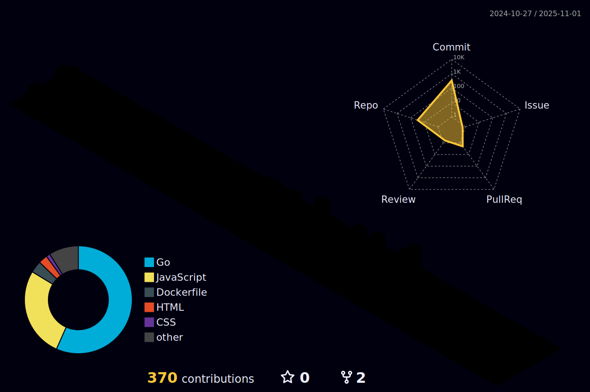

<h1 align="center">Hi! I'am Cesar Menegatti</h1>

###

🔭 I’m currently working on Golang and Rust 👯 I’m looking to collaborate on everything that’s possible 🤠I’m looking for help with myself 🌱 I’m currently learning Kubernets 💬 Ask me about me ⚡ Fun fact: I know how to make popcorn

###

 

  
  

###

  
  
  
  
  
  
  
  
  
  
  
  
  
  
  
  
  
  
  
  
  
  
  
  
  
  
  
  
  
  
  
  
  
  
  
  
  
  
  
  
  
  
  
  
  
  
  
  
  
  
  
  
  
  
  
  
  
  
  
  
  
  
  
  
  
  
  
  
  
  
  
  
  
  
  
  
  
  
  
  
  
  
  
  
  
  
  
  
  
  
  
  
  
  
  
  
  
  
  
  
  
  
  
  
  

###

  
  
  
  
  

###

 

## My Contribution snake
<picture>
  <source media="(prefers-color-scheme: dark)" srcset="https://raw.githubusercontent.com/chmenegatti/chmenegatti/output/github-contribution-grid-snake-dark.svg">
  <source media="(prefers-color-scheme: light)" srcset="https://raw.githubusercontent.com/chmenegatti/chmenegatti/output/github-contribution-grid-snake.svg">
  
</picture>

## My Contribution Graph

###

###

## 🏆 GitHub Trophies

### ✍️ Random Dev Quote

-----

<!-- Proudly created with GPRM ( https://gprm.itsvg.in ) -->
