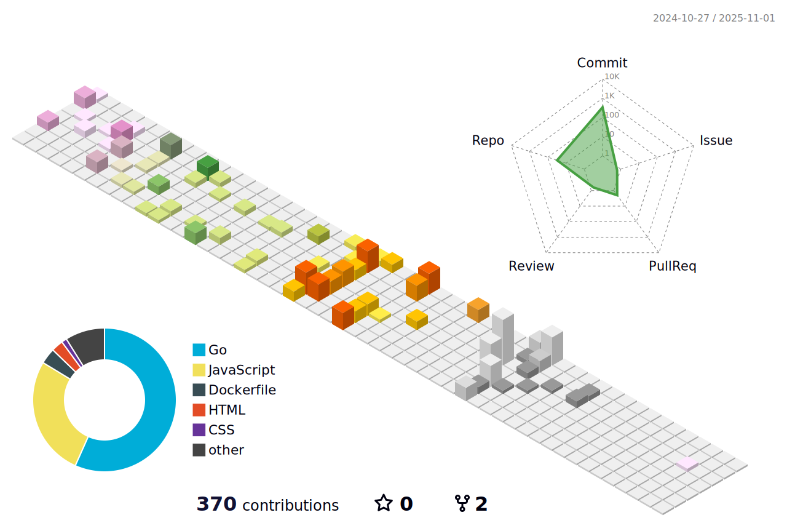

  

  

  
  
  

---

## 👋 About me

- 🚀 Building backend systems with **Go** and **Rust**
- ☸️ Focused on **Kubernetes**, observability and cloud-native architecture
- 🧠 I enjoy performance tuning, distributed systems and DevOps workflows
- 🍿 Fun fact: I make serious popcorn and nice coffee

I’m a software engineer who likes to combine product mindset with low-level performance and reliability. My day-to-day work is usually around backend APIs, distributed services, CI/CD pipelines and infra automation.

---

## 🎯 Current focus

- Designing resilient microservices with clear domain boundaries
- Improving developer experience with better tooling and release flows
- Studying advanced Kubernetes patterns for scalable workloads
- Building reusable Go libraries for real-world backend problems

---

## 🧭 How I work

- **Pragmatic architecture:** simple solutions first, scale when needed
- **Quality mindset:** tests, observability and maintainability by default
- **Collaboration:** async communication, clear docs and fast feedback loops
- **Performance:** profiling and measurement before optimization

---

## ⚡ Tech stack

  

---

## 📈 GitHub analytics

  
  

  

  

---

## ⭐ Featured projects

### [go-date-fns](https://github.com/chmenegatti/go-date-fns)
Modern date utility library for Go inspired by date-fns, focused on pure functions, immutability and practical date/time operations.

### [lazylog](https://github.com/chmenegatti/lazylog)
Flexible and extensible logging library for Go with structured output, transport abstraction and clean integration patterns.

### [gocachex](https://github.com/chmenegatti/gocachex)
Distributed cache abstraction with multiple backends and production-oriented features for scalable applications.

---

## 🌌 3D contribution map

  

---

## 🏆 Highlights

  
  
  
  

- 📦 Building open-source libraries focused on backend developer experience
- 🧪 Emphasis on reliability: tests, observability and production-readiness
- ⚙️ Main stack in practice: Go, Rust, Kubernetes and cloud-native tooling
- 🤝 Open to collaboration in backend, infrastructure and platform engineering

---

## 💬 Quote

  

---

## 🤝 Let’s connect

- LinkedIn: https://linkedin.com/in/chmenegatti
- Instagram: https://www.instagram.com/lazydogbrasil/
- GitHub: https://github.com/chmenegatti

  Code. Build. Learn. Repeat.

  

